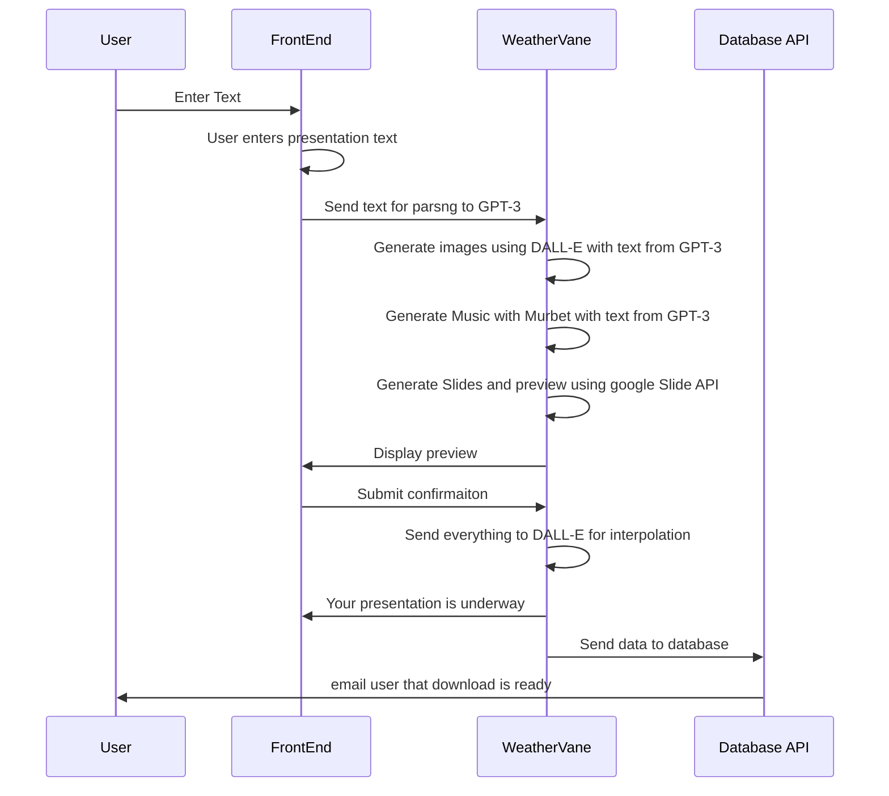

# Weather_Vane

<h3 align="center">WeatherVane - Whisper GPT3 Codex & DALL-E 2 Open AI Hackathon</h3>
 
    This repo contains all the work for WeatherVanes team contribution in OpenAI's Whisper Hackathon
 

<!-- ABOUT THE PROJECT -->
## About The Project
<!-- [![Product Name Screen Shot][product-screenshot]](https://example.com) -->

***Product Name***
WeatherVane (v1.0.0)

***Problem***
Regardless of the context time is always precious.
Presenting ideas is always necessary from starting small projects to guiding important decisions but making good presentations takes time.
Making an impact is done by creating a sensory experiences.

***Solution***
Using OpenAI GPT-3, DALL-E 2 and Murbet, we are created an automated presentation platform that will make your desired presentation with just the data you wish to present and some key words.

***How it works***
This is a high-level overview of how the project works. For more details, please refer to the [WeatherVane google collab]([https://miro.com/app/board/uXjVPNAvrXg=/](https://colab.research.google.com/drive/1BoNuDiHlC3eI82OoRqewlP6D6bdQJIvH?usp=sharing))

